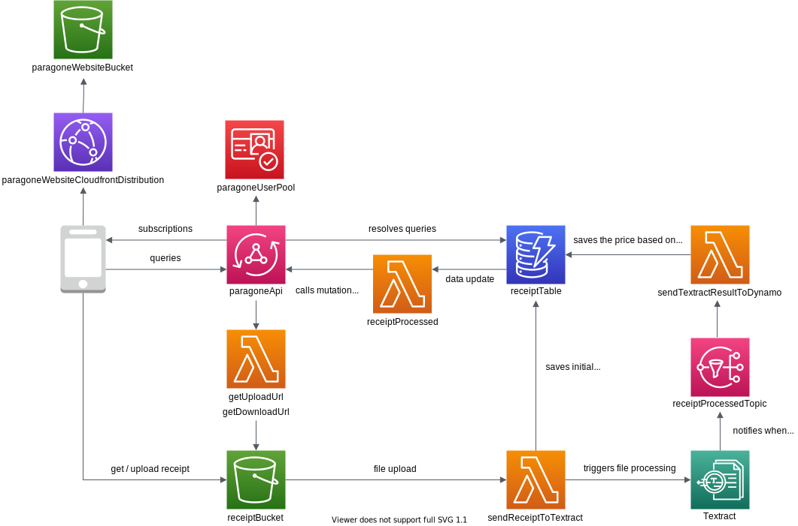

# Paragone

## How it works?

The whole application architectures consist of 2 stacks:

- `ParagoneFrontendStack` - stores frontend app built with React in Amazon S3, using Amazon CloudFront as CDN
- `ParagoneStack` - handles the backend for the applications. GraphQL API serves as an entry point to the app and uses Cognito for authentication. User get presigned URL for the S3 bucket to store (`getUploadUrl`) and retrieve (`getDownloadUrl`) receipt images. Inserting new object into the bucket triggers the asynchronous processing - `sendReceiptToTextract` Lambda stores the image metadata in DynamoDB and starts the image processing using Textract. When the analysis is finished, `sendTextractResultToDynamo` Lambda, listening for SNS notification, is triggered. It analyses the results of processing and stores them in DynamoDB. When the data is inserted or updated in DynamoDB, it triggers `receiptProcessed` Lambda performing GraphQL mutation, which in turn triggers the GraphQL subscription, that enables clients to get the update pushed to their web apps.

## Demo

  

